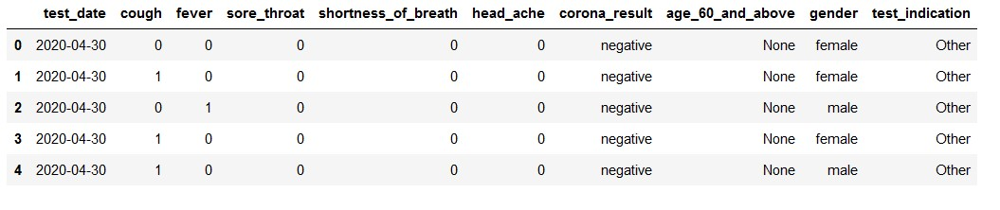
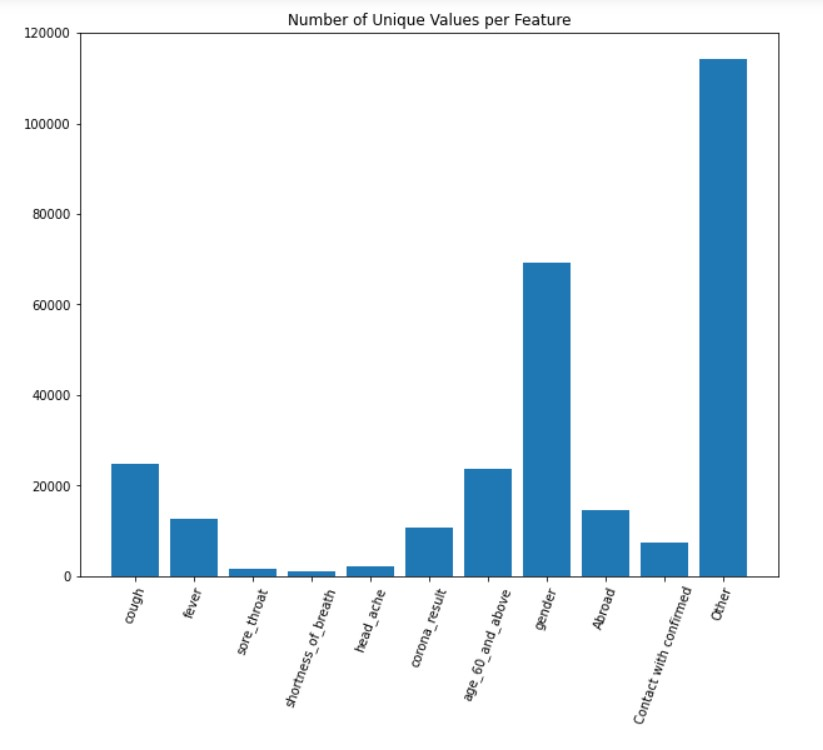
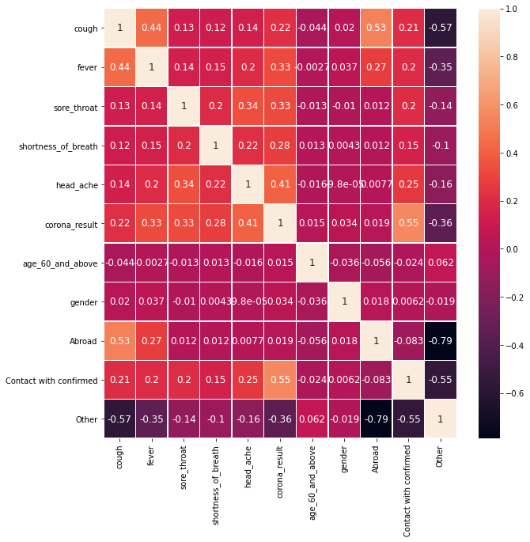
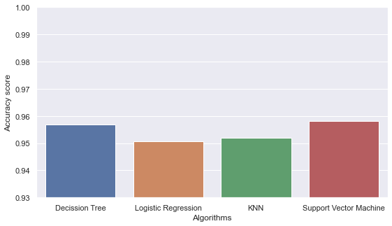
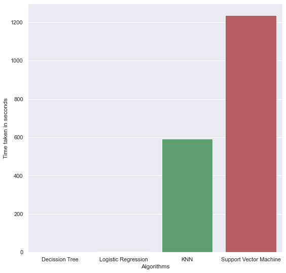

# Covid-19 Detection using ML

The goal of this project is to predict covid-19 from the symptoms observed in the patients during the Covid-19 test along with different factors of the individuals.

	1.To train a model to predict Covid-19 positive or negative based on  symptoms.
	2.To minimize the chance of Positive person is  being classified as Negative (i.e minimizing False positive   < 5 )..
	3.Implementing machine learning model for classifying the records in the  dataset correctly, consistently and time efficiently.

## Dataset

The dataset used in this project **corona_tested_individuals.csv** has 9 different features along with symptoms, date, age, and the test_indication.

## Environment
We used **Python 3.6** for this project and implemented the code in **Jupyter Notebook**

## Code

The code for this project is written in Python and uses the Keras library for building the machine learning model. The code is available in the `covid-19_detection.py` file. You can run the code using the command: python covid-19_detection.py

## Data Visualisation
### Bar Plot

### Count Plot

### Correlation

## Results

Our model achieved an accuracy of 95% on the test set. The detailed results are presented below.
### Accuracy comparision after Hyperparameter Tuning

### Accuracy of different Models

### Execution Time for different models

## Conclusion

The study aimed to create a machine learning model for predicting COVID-19 using fewer features and tests. The study used four classification techniques and nine key features, with support vector machine and decision trees yielding the best outcomes.

## Contributors

	-Svachuta Siva Sai Krishna Prasad Gollavilli
	-Sravan Kumar Reddy Pebbeti
	-Keerthana Krishnamoorthy

